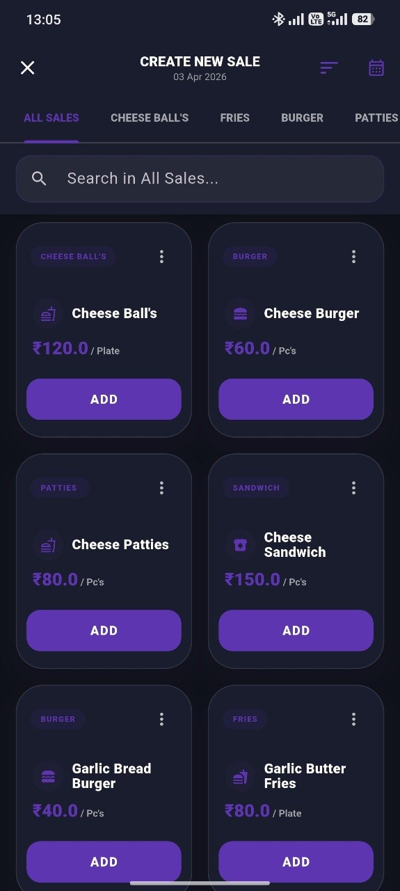

# Apna Hisaab 📊

**Apna Hisaab** is a professional Point of Sale (POS) and Business Management application built with Flutter. Specifically designed for restaurants and small businesses to manage their daily sales, inventory, staff, and financial reports seamlessly.

## 📱 App Screenshots

| Dashboard | Password/Biometric | Reports | Stock |
| :---: | :---: | :---: | :---: |
|  |  |  |  |

## 🚀 Key Features

### 💻 Adaptive & Responsive Design
- **Multi-Device Support**: Optimized for standard Mobile phones, **Tablets**, and **Foldable devices**.
- **Dynamic Navigation**: Uses a side **Navigation Rail** on large screens and a bottom TabBar on mobile to maximize screen real estate.
- **Flexible Grids**: UI elements automatically adjust column counts based on screen width.

### 🛒 Smart Billing & POS
- **Plate Logic**: Support for Half and Full portions with automatic price calculation (e.g., 1.5 qty correctly sums 1 Full + 1 Half price).
- **Custom Pricing**: Flexibility to edit prices during checkout with snapshot-based historical reporting.
- **Pending Orders**: Manage running tables/orders and complete them later.
- **Tax & Discounts**: Automatic calculation of taxes and item-wise or bill-wise discounts.

### 📦 Inventory & Stock Control
- Real-time stock tracking for every item.
- **Low Stock Alerts**: Automatic popups when items reach a critical level.
- Category-wise inventory management.

### 📈 Business Analytics & Reports
- **Dynamic Dashboard**: View today's Revenue, Expense, and Net Profit at a glance.
- **Weighted Contribution Reporting**: Accurate revenue split even when selling fractional portions or using custom prices.
- **Filtered History**: Search and filter transactions by date range, payment mode, or category.
- **Sticky Headers**: Scroll through long history while keeping totals and summaries visible at the top.

### 👥 Staff & Supplier Management
- **Payroll**: Track monthly salaries, advance payments, and leave deductions.
- **Suppliers**: Maintain a directory of suppliers and items they provide.

### ☁️ Cloud Sync & Security
- **Firebase Integration**: Real-time cloud backup and restore.
- **Persistent Sessions**: Stay logged in securely even after closing the app.
- **Admin Panel**: Control user licenses, activation status, and global announcements.

### 📄 Professional Exports
- **Invoices**: Generate and print professional PDF bills (80mm roll format).
- **Excel Reports**: Export complete sales/expense data to XLSX for accounting.

## 🛠 Tech Stack
- **Frontend**: Flutter (Dart)
- **Database**: SQLite (Local storage for offline speed)
- **Backend**: Firebase (Auth, Firestore for sync)
- **State Management**: Provider
- **Local Utilities**: Workmanager (Background backups), Shared Preferences.

## ⚙️ Installation

1. **Clone the repo**:
   ```sh
   git clone https://github.com/your-username/list_maker.git
   ```
2. **Install dependencies**:
   ```sh
   flutter pub get
   ```
3. **Setup Firebase**:
   - Create a project on [Firebase Console](https://console.firebase.google.com/).
   - Add Android/iOS apps and download `google-services.json`.
4. **Run the app**:
   ```sh
   flutter run
   ```

## 👨‍💻 Developer
**Nikkhil Barwar** - [+919992256959 call/WhatsApp]

---
*Built with ❤️ for professional business management.*
